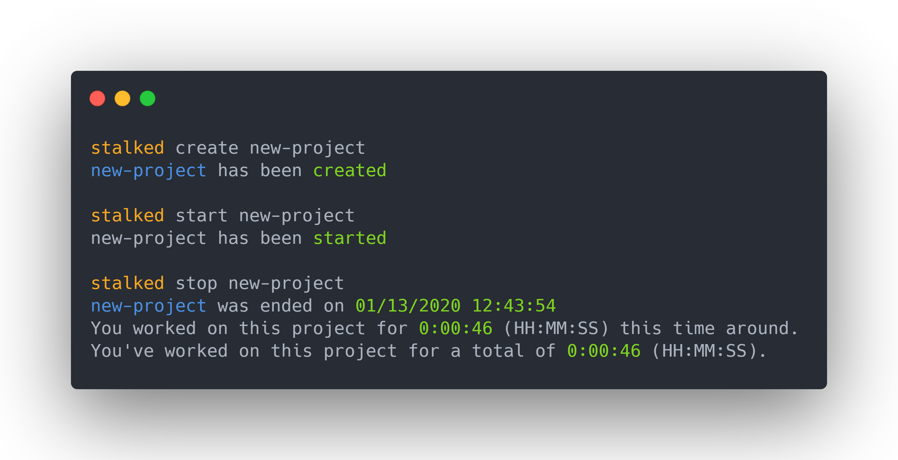

# Stalked
> A dead simple project time tracker CLI.

</img>

## Install
```
npm install stalked
```

## Usage
```sh
Usage: stalked <command> [project]

Project Time Tracker

Options:
  -v, --version       output the version number
  -h, --help          output usage information

Commands:
  create|c <project>  Create a project
  start|s <project>   Start tracking a project
  stop|e <project>    Stop tracking a project
  time|t <project>    Check the current amount of time you have worked on a project
  delete|d <project>  Delete a given project
  list|l              List all project names
```

## Local Storage

### All project information is saved locally to `localstorage.json` - You have full control over your data.


